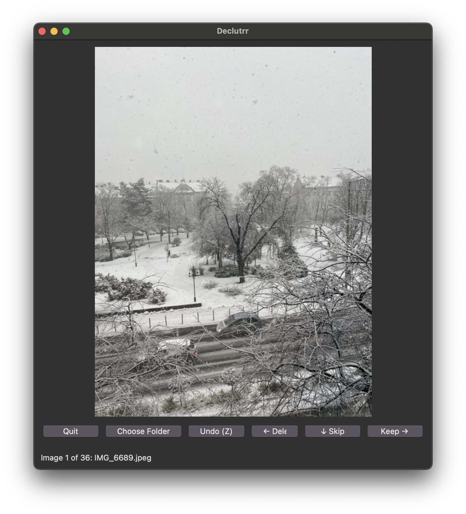

# 🎯 Declutter

[](https://pypi.org/project/declutrr/)
[](https://codecov.io/gh/vmatt/declutrr)
[](https://opensource.org/licenses/MIT)
A Date-app-like interface for rapidly sorting photos into "keep" and "delete" categories. Perfect for photographers who need to quickly curate large collections of images.

## ✨ Features

- **🎨 Simple Interface**: Clean, intuitive UI for rapid photo sorting
- **📅 Smart Sorting**: Photos displayed in chronological order using EXIF data
- **⌨️ Keyboard Shortcuts**: Quick sorting using arrow keys
- **↩️ Undo Support**: Easily reverse any sorting decision
- **⏭️ Skip Option**: Temporarily skip photos you're unsure about
- **📊 Progress Tracking**: Clear status display of sorting progress

## 🚀 Installation

1. Clone the repository:
```bash
git clone https://github.com/NamiLinkLabs/declutrr.git
cd declutrr
```

2. Install dependencies:
```bash
pip install -r requirements.txt
```

## Usage

Launch declutrr PhotoSwiper in one of two ways:

1. Without a directory specified:
```bash
python declutrr.py
```

2. With a specific directory:
```bash
python declutrr.py /path/to/your/photos
```

### Controls
- **→ (Right Arrow)**: Keep photo
- **← (Left Arrow)**: Delete photo
- **↓ (Down Arrow)**: Skip photo
- **Z**: Undo last action

## 📋 Requirements

- 🐍 Python 3.10+
- 🖼️ Pillow (PIL) 11.0.0+


# 🛠️ Additional Tools

## 📋 Requirements

- 🐍 Python 3.10+
- 🖼️ Pillow (PIL) 11.0.0+
- 👁️ OpenCV (cv2)
- 🤖 ultralytics (YOLOv11)
- 🎨 tkinter (included with Python)


### 🏷️ Auto Tagger (scripts/auto_tagger.py)
Automatically tags photos using AI-powered object detection:
- 🤖 Uses YOLOv11 for object detection and classification
- 🎯 Adds Finder tags based on detected content
- 📁 Perfect for organizing photos by content

### 🔍 Blur Detector (scripts/blur_detector.py)
Identifies and separates blurry photos:
- 📊 Uses Laplacian variance to detect image blur
- 📂 Moves blurry photos to a separate folder
- ✨ Helps maintain photo collection quality

### 📱 Screenshot Detector (scripts/screenshot_detector.py)
Identifies and organizes screenshots:
- 🤖 Uses AI and traditional CV methods
- 🔍 Detects UI elements and screen contents
- 📂 Separates screenshots from regular photos

### 🔧 Utility Scripts
- **📅 move.sh**: Organizes photos into YYYYMM folders
- **✏️ renamer.sh**: Renames photos using EXIF date/time
- **📱 screenshot.sh**: Quick screenshot organization

## 🤝 Contributing
Contributions are welcome! Feel free to submit a pull request or open an issue.
## 📄 License

This project is licensed under the MIT License - see the LICENSE file for details.
